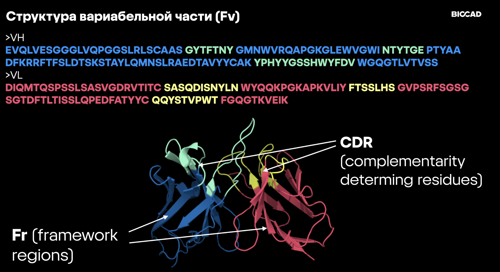
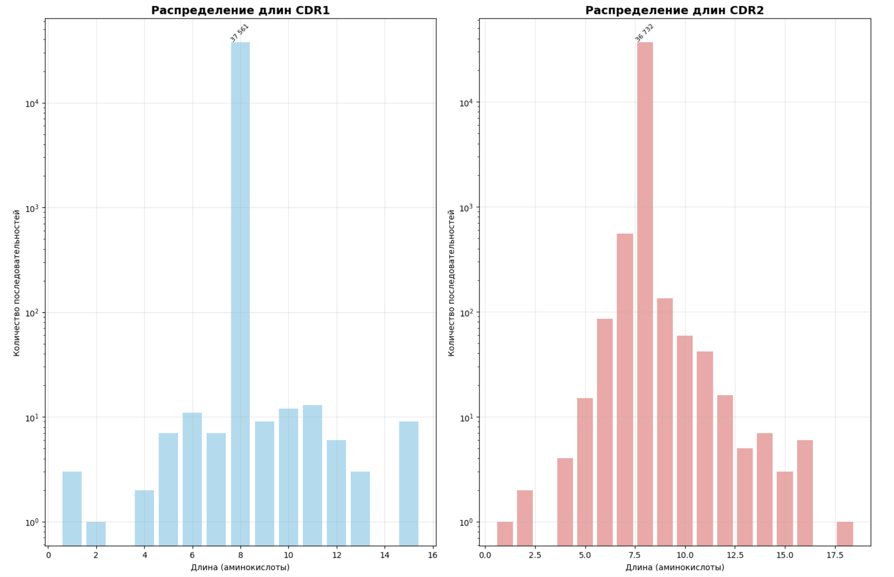
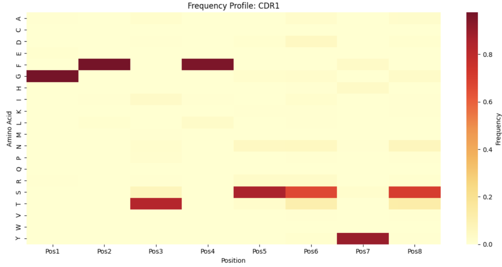
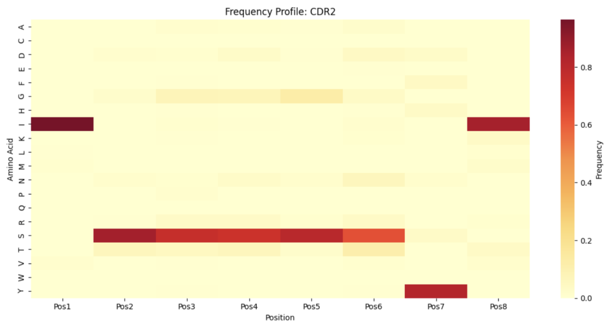
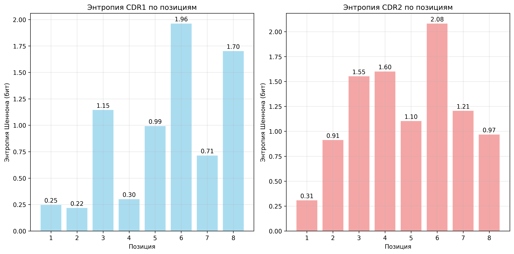
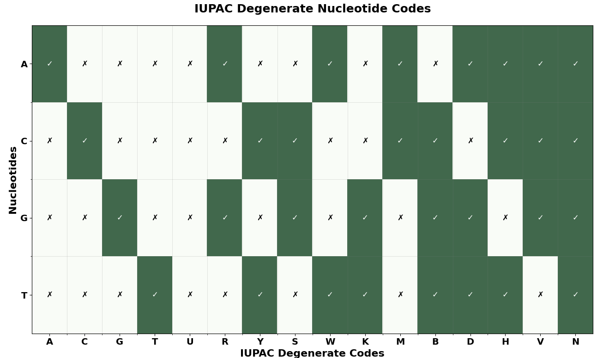

# Дизайн минимального пула вырожденных олигонуклеотидов для библиотек антител

Написать алгоритм для получения минимального пула вырожденных олигонуклеотидных последовательностей, таким образом чтобы соотвествующие им аминокислотные последовательности максимально близко воспроизводили разнообразие человеческих последовательностей CDR.
Также необходимо показать, что разнообразие получаемых продуктов, минимально расходится с тем, что наблюдается в человеческих антителах (не содержит лишних последовательностей, нетипичных для человеческих антител комбинаций и позиций).
OAS (https://opig.stats.ox.ac.uk/webapps/oas/)
- выборка из Paired последовательностей (human, no disease)
- V-ген: IGHV3-21
- подбор олигонуклеотидов для HCDR1 и HCDR2

## Данные
- **Источник:** OAS (Observed Antibody Space)
- **Ген:** IGHV3-21
- **Область:** HCDR1 и HCDR2 тяжелой цепи

- **Отбор:** Paired-end sequencing, no disease

### Последовательность действий:

1. Из наших .csv файлов создан один .csv файл только с нашими cdr1 и cdr2 и аллельными вариантами IGHV3-21*n, где n - аллельный вариант **"all_ighv3-21_cdr_data.csv"**
2. Отфильтрованы данные - оставлены последовательности с длиной cdr1 и cdr2 равной 8 аминокислот - **ighv3-21_cdr_both_length8.csv**. Статистика по длинам до фильтрации:

3. Построены частотные профили позиций для аминокислот.

4. Проанализирована энтропия CDR регионов **cdr_entropy_profiles.ipynb**:
- **Низкая энтропия**: консервативная позиция, одна доминирующая аминокислота

Из полученных гистограм мы решили оставить 1, 2 и 4 аминокислоты в CDR1 и 1 аминокислоту в CDR2 как строго консервативные.
5. Введены следующие обозначения:
  
